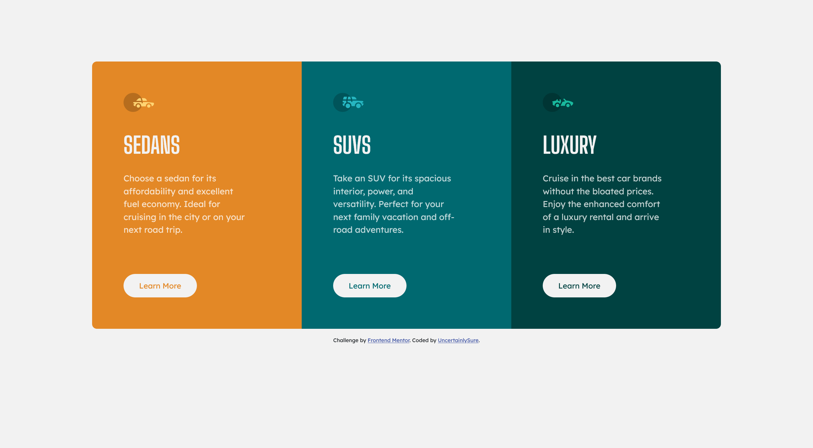

# Frontend Mentor - 3-column preview card component solution

This is a solution to the [3-column preview card component challenge on Frontend Mentor](https://www.frontendmentor.io/challenges/3column-preview-card-component-pH92eAR2-). Frontend Mentor challenges help you improve your coding skills by building realistic projects.

## Table of contents

- [Overview](#overview)
  - [The challenge](#the-challenge)
  - [Screenshot](#screenshot)
  - [Links](#links)
- [My process](#my-process)
  - [Built with](#built-with)
  - [What I learned](#what-i-learned)
  - [Continued development](#continued-development)
  - [Useful resources](#useful-resources)
- [Author](#author)

**Note: Delete this note and update the table of contents based on what sections you keep.**

## Overview

### The challenge

Users should be able to:

- View the optimal layout depending on their device's screen size
- See hover states for interactive elements

### Screenshot



### Links

- Live Site URL: https://uncertainlysure.github.io/3-Column-Preview-Card-Component/

## My process

### Built with

- HTML5
- CSS3
- Bootstrap 5

### What I learned

```html
<div class="container">
  <div class="row car-row">
    <div class="col-sm sedans">
      
      <h1>SEDANS</h1>
      <p>
        Choose a sedan for its affordability and excellent fuel economy. Ideal
        for cruising in the city or on your next road trip.
      </p>
      <button class="btn btn-light btn-sedans">Learn More</button>
    </div>
    <div class="col-sm suv">
      
      <h1>SUVS</h1>
      <p>
        Take an SUV for its spacious interior, power, and versatility. Perfect
        for your next family vacation and off-road adventures.
      </p>
      <button class="btn btn-light btn-suv">Learn More</button>
    </div>
    <div class="col-sm luxury">
      
      <h1>LUXURY</h1>
      <p>
        Cruise in the best car brands without the bloated prices. Enjoy the
        enhanced comfort of a luxury rental and arrive in style.
      </p>
      <button class="btn btn-light btn-luxury">Learn More</button>
    </div>
  </div>
</div>
```

```css
.car-row {
  margin-top: 10%;
}

.sedans,
.suv,
.luxury {
  padding: 5%;
}

.sedans {
  background-color: hsl(31, 77%, 52%);
  border-radius: 10px 0 0 10px;
}

.suv {
  background-color: hsl(184, 100%, 22%);
}

.luxury {
  background-color: hsl(179, 100%, 13%);
  border-radius: 0 10px 10px 0;
}

.btn-sedans,
.btn-suv,
.btn-luxury {
  font-family: "Lexend Deca", sans-serif;
  margin-top: 4rem;
  padding: 10px 30px;
  border-radius: 100px;
  border: 3px solid hsl(0, 0%, 95%);
  background-color: hsl(0, 0%, 95%);
}

.btn-sedans {
  color: hsl(31, 77%, 52%);
}

.btn-sedans:hover {
  color: hsl(0, 0%, 95%);
  background-color: hsl(31, 77%, 52%);
  border: 3px solid hsl(0, 0%, 95%);
}

.btn-suv {
  color: hsl(184, 100%, 22%);
}

.btn-suv:hover {
  color: hsl(0, 0%, 95%);
  background-color: hsl(184, 100%, 22%);
  border: 3px solid hsl(0, 0%, 95%);
}

.btn-luxury {
  color: hsl(179, 100%, 13%);
}

.btn-luxury:hover {
  color: hsl(0, 0%, 95%);
  background-color: hsl(179, 100%, 13%);
  border: 3px solid hsl(0, 0%, 95%);
}

@media (max-width: 580px) {
  .btn-sedans,
  .btn-suv,
  .btn-luxury {
    margin-top: 1rem;
  }

  .sedans,
  .suv,
  .luxury {
    padding: 12%;
  }

  .sedans {
    border-radius: 10px 10px 0 0;
  }

  .luxury {
    border-radius: 0 0 10px 10px;
  }
}
```

### Continued development

The mobile design could use more improvement.

### Useful resources

- [Bootsrap Website](https://getbootstrap.com/) - This help me get to know more about the grid system bootstrap has

## Author

- Frontend Mentor - [@UncertainlySure](https://www.frontendmentor.io/profile/UncertainlySure)
